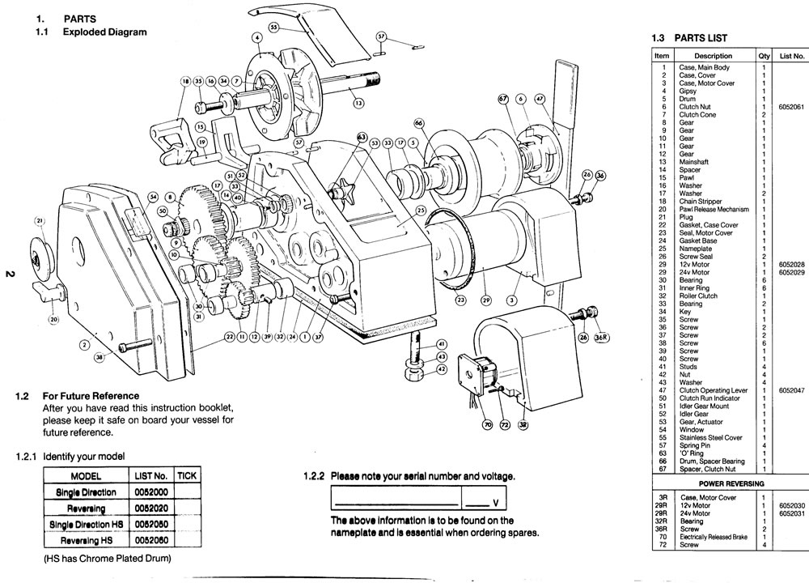
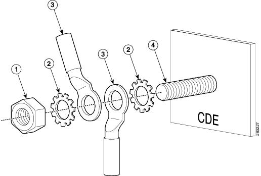

# Parts-List-Generator
Generates a Parts List by counting and sorting parts &amp; hardware stack-ups needed for a install/remove job.

Example of a Parts List on the right side of image below:

### Getting Started:
1. See `PartsandHardwareStackUps.ipynb` for an example of parts and hardware stack-ups needed for a job
2. See `PartsListGenerator.ipynb` for an example of how the Parts List is generated.

### How to use:
1. To customize, edit the `PartsandHardwareStackUps` file to your parts and harware needed.
2. Run the `PartsListGenerator` to generate your Parts List!

Both Jupyter Notebook and Script versions provided for convienance. 

### Description
For an install/remove job, it is easy to keep track of the bigger parts needed, but a little more tedious to count the hardware needed.

An easier approach is to keep track of hardware stack-up occurnaces.

An example of a hardware stack-up can be seen below.  This could be called stack-up-A for example:

In an install/remove job, there could be multiple occurances of stack-up-A.  There could also be multiple occurances of other hardware stack-ups as well.  E.g...

- stack-up-A, occurs 20x's
- stack-up-B, occurs 5x's
- ...
- ...
- stack-up-XYZ, occurs 4x's

It can easily become tedious and error prone to keep track of the individual hardware counts.

This script was created to easily help you keep track of the hardware stack-ups occurances (less tedious and error prone) and automatically generates an ordered Parts List of all the hardware needed (as well as the bigger parts needed if included).

Example of an install/remove job with multiple parts and stack-up occurances.  Parts List on the right side of image:

Feedback welcomed! :)
